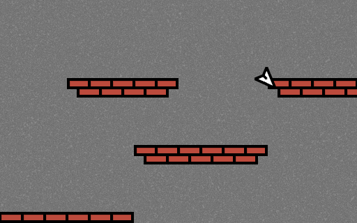
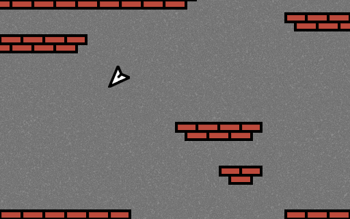

# Paper Plane

Port of [this game](https://ticalc.org/archives/files/fileinfo/341/34139.html) to raylib.

## Gameplay



Your goal is to fly a paper plane through obstacles and get to the bottom of the map.

Your score is dictated by how far down the level you get.



## Building

This game can be built using make.

Install:

```bash
# to install make and gcc
sudo apt install build-essential # debian and it's derivatives
sudo pacman -S base-devel # arch and it's derivatives
```

Obtaining Raylib:

Follow the build instruction on the [raylib github](https://github.com/raysan5/raylib/). 

Once you have a compiled copy of the library, you can set RAYLIB when running make to the path of the library (defaults to /usr/local/lib/).

You also need to set RAYLIBINC to the location of raylib.h, (this defaults to /usr/local/include/).

Build:

```bash
make RAYLIB=/path/to/raylib/binary/ RAYLIBINC=/path/to/raylib/header/ -jN # builds the application, N is the number of jobs to use.
```

Run:

```bash
./paper # run the executable you just built
```

## Credits

This game is a port of [Paper Plane](https://ticalc.org/archives/files/fileinfo/341/34139.html) from the TI-83+/84+ series of graphing calculators, which itself is a port of a minigame from Wario Ware Inc. on the GBA.

The map is a direct conversions from the calculator version.